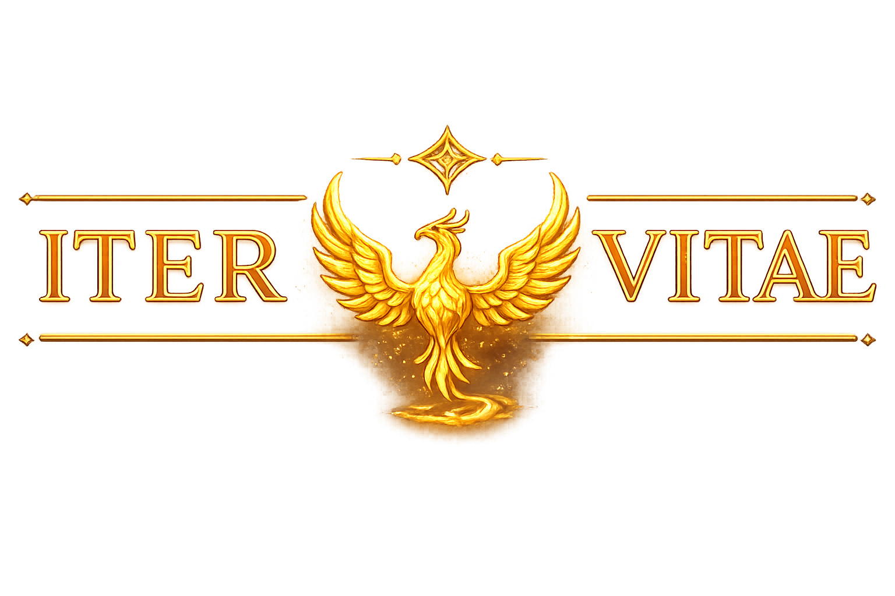

  

<h1 align="center">ITER VITAE — Playable Demo</h1>

  A completed retro-inspired 2D platformer, with a browser demo.

  <strong>Demo link coming soon</strong> 
  Desktop browser · Keyboard required · No installation

## About the project

ITER VITAE combines pixel-art environments, responsive platforming, and world-based progression. Players navigate obstacles, encounter enemies, collect rewards, and use power-ups to reach each level's exit.

The project brings together game programming, level design, visual presentation, audio integration, and desktop packaging. The full game is **complete**, with seven worlds, 28 platforming levels, and seven boss encounters.

This repository is the public project showcase. The source code is maintained privately.

## What you can play

The **demo** includes an introductory video and a playable introduction to ITER VITAE.

- Explore a pixel-art world with collectibles, hidden rewards, and environmental hazards.
- Experience the game's movement, enemies, and power-up systems.
- Save progress locally through the game menus and return to it in the same browser.
- Use the settings menu to review controls and toggle audio.

## Visual preview

*Environment artwork from the demo. Gameplay adds the player, enemies, platforms, collectibles, and HUD.*

## Project at a glance

| Detail | Description |
| --- | --- |
| Project status | Complete |
| Genre | 2D platformer |
| Public demo | Playable browser demo |
| Full game | Seven worlds, 28 levels, seven boss encounters |
| Visual style | Retro-inspired pixel art |
| Demo platform | Desktop web browser |
| Game resolution | 800 × 450, scaled proportionally to the window |
| Save system | Browser-local storage |

## Tech stack

| Technology | Role |
| --- | --- |
| **JavaScript · ES modules** | Gameplay logic, entities, scene transitions, and UI |
| **Phaser 4** | Rendering, animation, keyboard input, and Arcade Physics |
| **Vite** | Development server and production web builds |
| **HTML & CSS** | Browser application shell and layout |
| **Web Storage API** | Local saves and audio preferences |
| **Electron & electron-builder** | Desktop runtime and packaging for the full game |

The browser demo runs without a backend service or user account.

## Engineering highlights

- **Scene-based architecture:** Dedicated scenes manage menus, gameplay, level transitions, and demo completion.
- **Separated player systems:** Movement, health, and power-up state live in dedicated modules.
- **Responsive movement:** Jump buffering and coyote time make platforming inputs more forgiving.
- **Reusable entities:** Shared classes support specialized enemy behaviors and interactive objects.
- **Level-driven content:** Individual JavaScript level definitions describe layouts, enemies, hazards, and rewards.
- **Shared audio management:** Music, sound effects, and persistent mute settings use a central module.
- **Independent demo delivery:** The standalone demo contains only its playable levels and selected assets, with a separate save slot.

The demo has six automated checks covering progression, its completion boundary, invalid level requests, saved-game restrictions, intro routing, and excluded content. Its production build and intro-to-gameplay flow have also been checked.

## Controls

| Action | Key |
| --- | --- |
| Move | Left / Right arrows |
| Jump | Space |
| Fire with a compatible power-up | Z |
| Pause / resume | P |
| Navigate menus | Up / Down arrows |
| Select / skip intro | Enter |
| Back | Esc |

Saves remain in the browser used to play. Clearing its site data removes saved progress.

## Credits

Built with JavaScript and Phaser, with Vite for web builds and Electron for full-game desktop delivery. The project includes third-party music and sound effects and AI assistance.

Third-party assets retain their respective terms. This showcase does not grant a separate license to reuse the game's code, artwork, or audio.
